# Intelligentcar2022-FZ3B

#### 介绍
全国大学生智能汽车竞赛-完全模型组-开源共享软件资源（Edgeboard-FZ3B）

严肃声明！！该软件方案仅限智能汽车竞赛学习交流，本人基于智能车爱好者维度向公众公开源代码，不涉及任何商业行为，请全体技术爱好者共同监督指导！！！

同时将继续汇集历届经验，持续为大家共享相关资源，欢迎批评改进，未完待续！！！

#### 软件架构
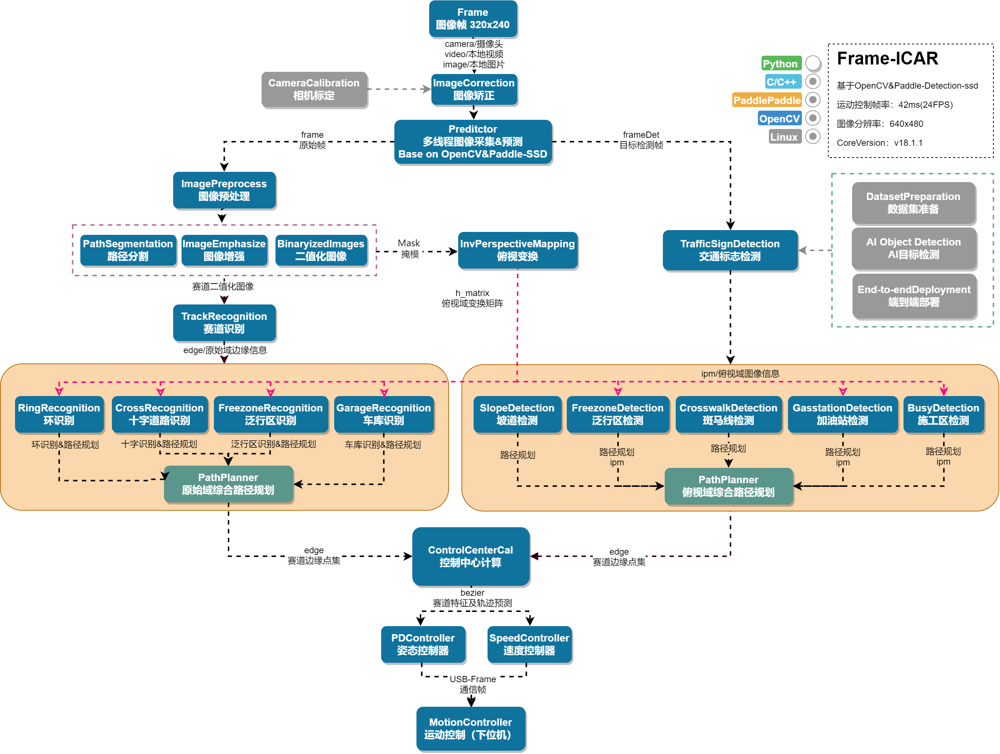

注意：该版本不包含所有功能块，部分内容需要各位参赛选手继续搭建...（环岛/加油站/泛行区）

#### 使用说明

1.  该软件工程基于C++/OpenCV2/Python2.7/PaddlePaddle-Detection搭建；
2.  基于百度智能汽车-完全模型组及赛事开源Edgeboard板卡FZ3B调试开发；
3.  默认将该软件下载到EB：root@EdgeBoard:~/workspace目录下即可启用；
4.  除此之外，该软件支持仿真调试（跑视频）/比赛模式两种方式运行；

#### 文件目录

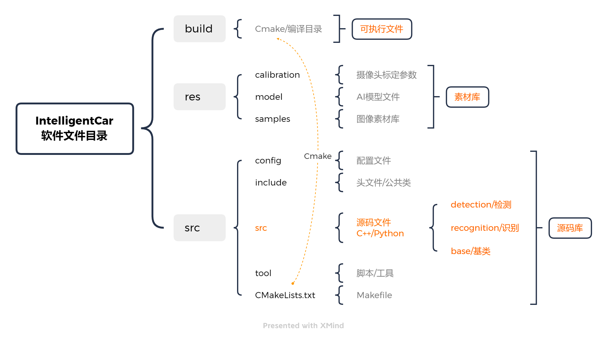

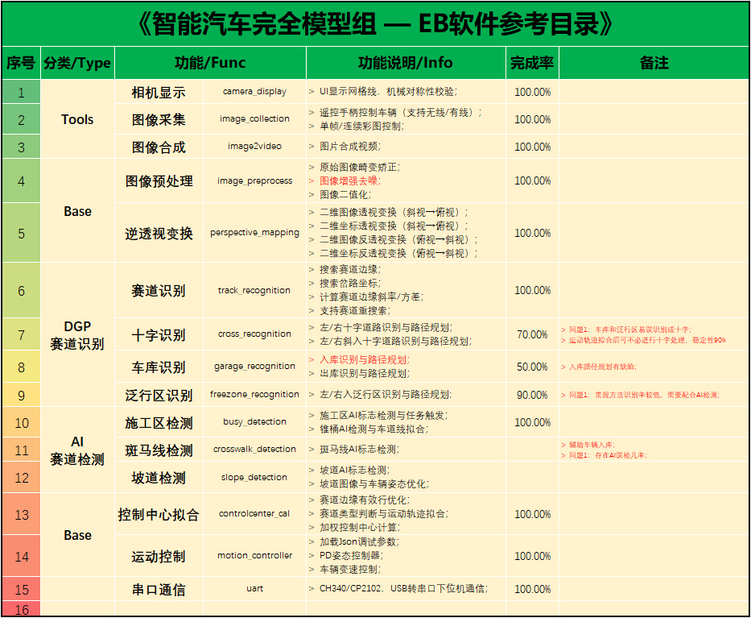

#### 程序启动说明

1. 编译代码/Make

   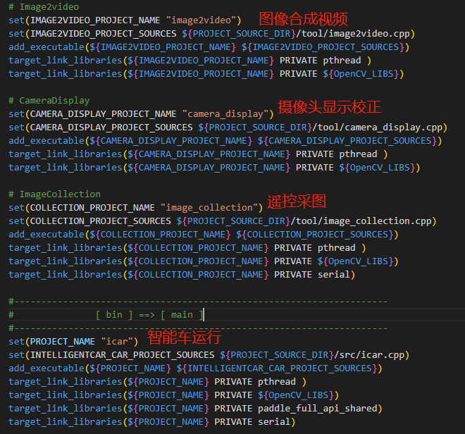

   编码可执行程序，可修改CMakeLists.txt；

   到build路径下cmake：

   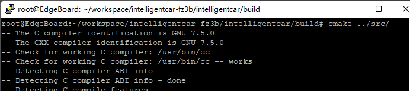

   编译代码：

   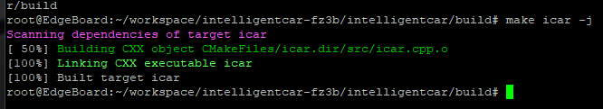

   

2. 修改config文件，启动相关模式

   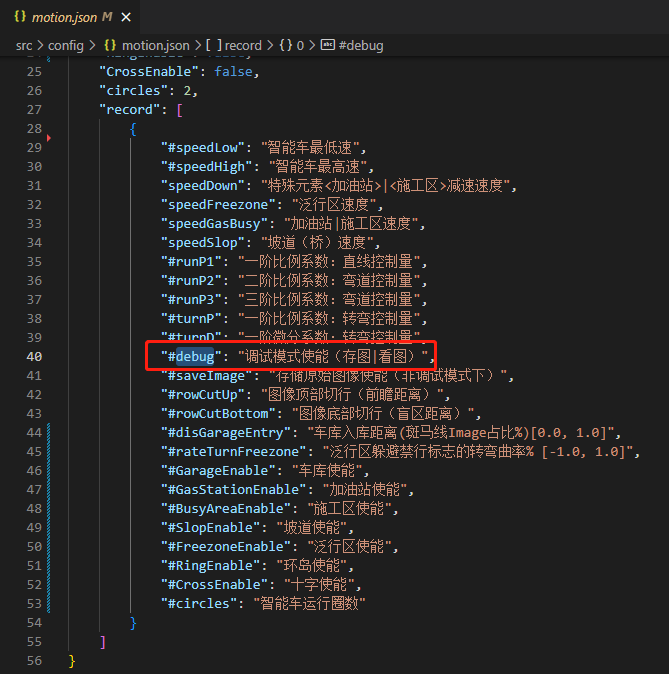

   ​		修改motion.json文件后，不必再次编译即可运行，方便后期调试。可通过debug标志启动仿真（跑视频）模式和比赛（竞速）模式，仿真模式下默认调取本地视频，并且通过VNC观察实时图像运算结果；比赛模式将关闭图像显示和图形绘制（省时间/10ms）。

   

3. 连接下位机，启动程序

   运行icar程序需要连接下位机，否则程序退出，插入ch340/cp2102的USB串口即可。

   

   

4. 查看运行结果（debug模式）

   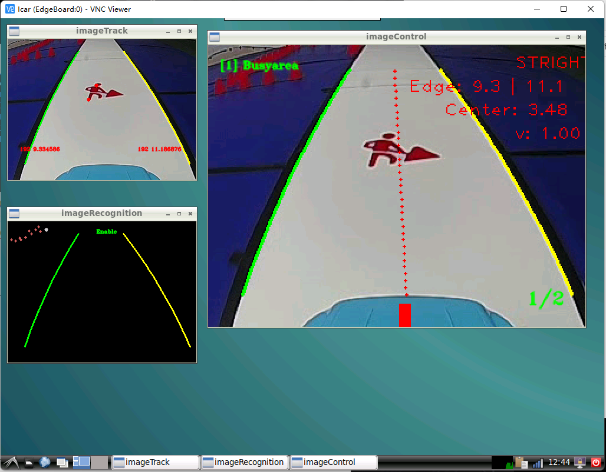

   

5. 赛道奔跑（竞赛模式）

   脱机运行：小车在赛道上奔跑时可通过 "nohup" 命令启动程序，此时拔掉网线继续运行。

   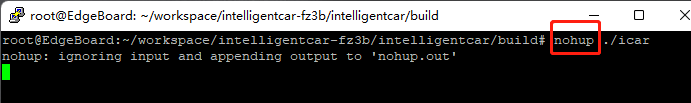

   若程序无法自行退出，待重新插上网线后，通过Ctrl+C终止进程，或者查询当前进程ID（ps -ef|grep ./icar）,并杀死当前进程（kill -9 ID）。

   

   

#### 图像处理思路

Image输出 → 预处理 → 赛道识别（Track） → 特殊元素识别（Rec/Det） →  路径拟合  → 运动控制  → 下位机

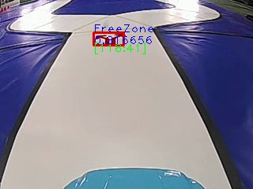

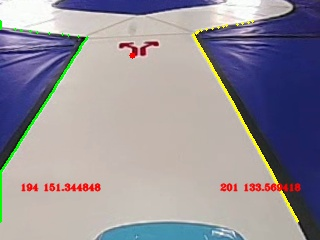

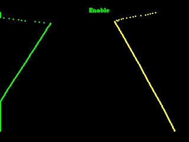

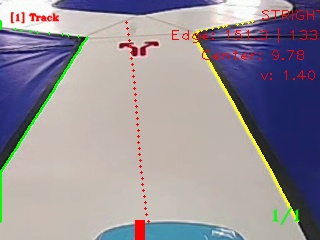

#### I车模配置

1. 摄像头前瞻距离：1.6~2.5米

   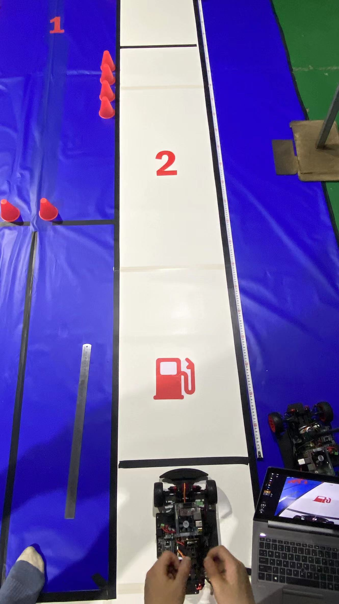

   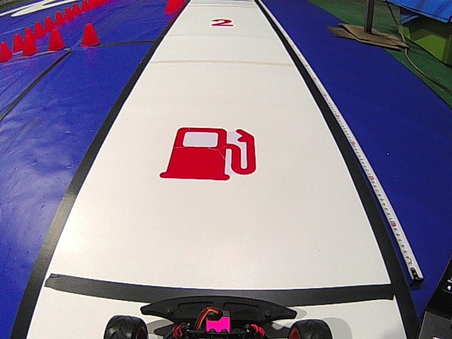

2. 下位机设计PID模型/电机模型-控速，控制单位：m/s (float)
3. 下位机舵机控制，TIM/定时器计数上限20000，频率50Hz，占空比控制阈值[500，2500]。上位机理论控制阈值[1100, 1500, 1900] / 左|中|右，舵机中值及左右阈值在实际的标定值上偏移。